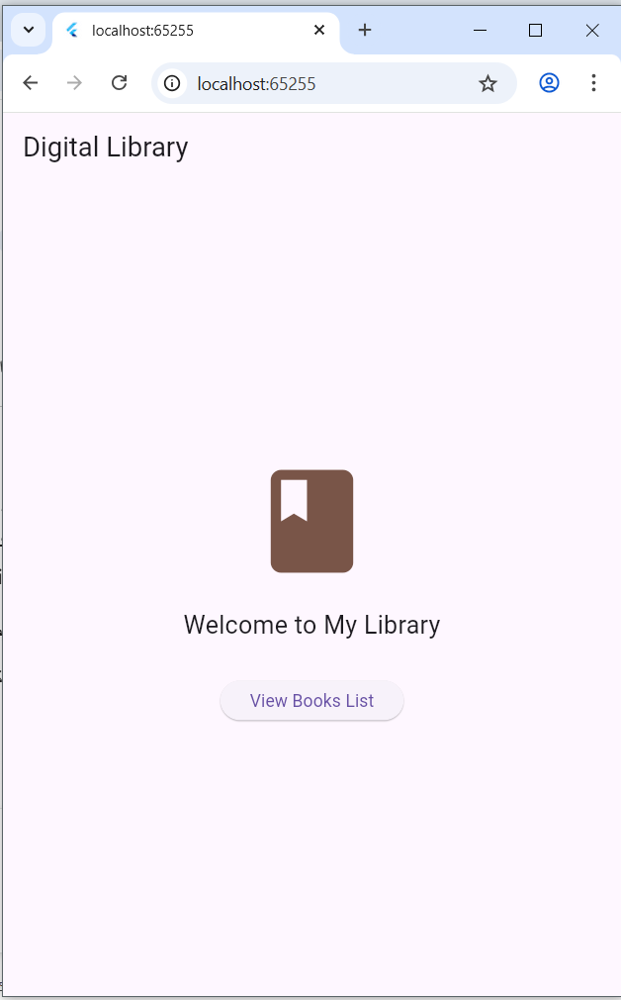
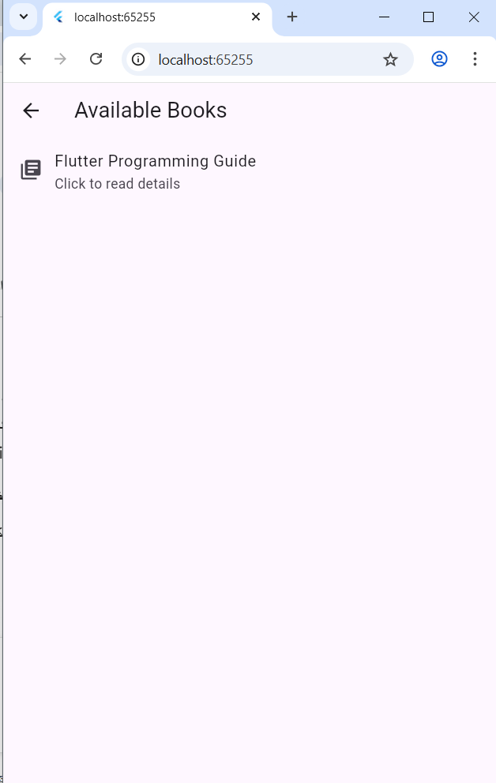
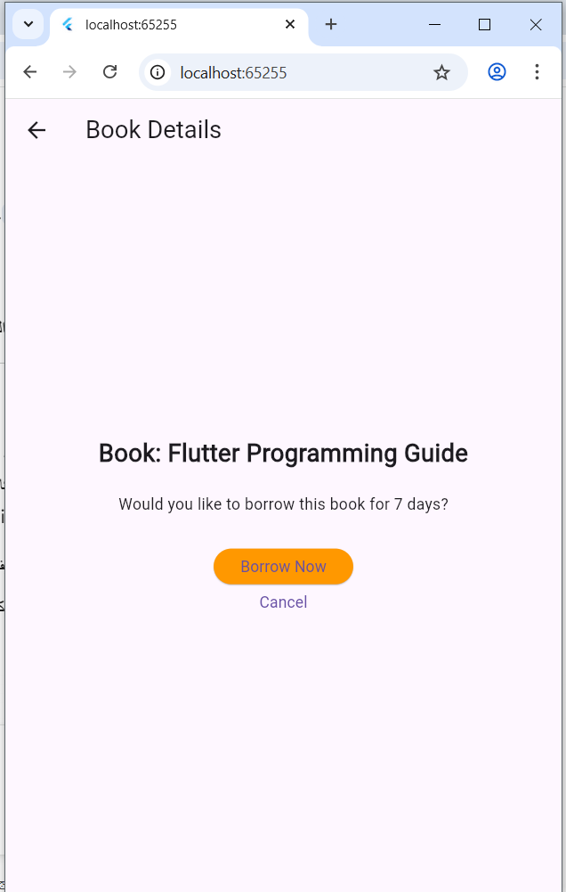
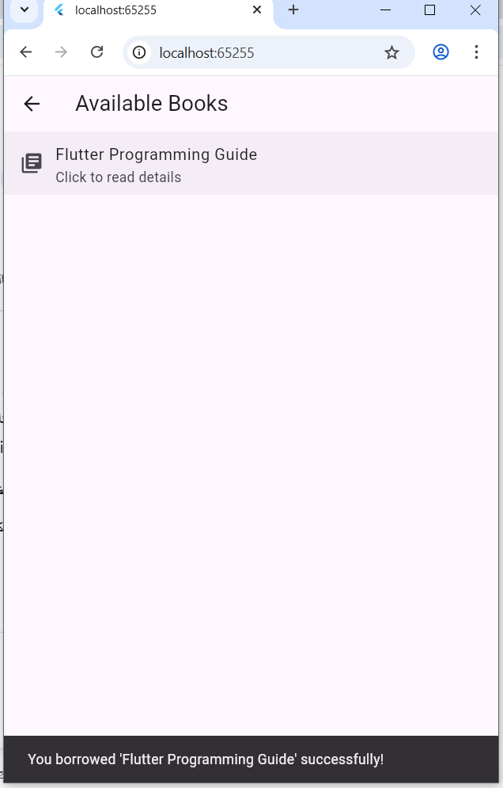

# Flutter_Navigation_Library
# Task 02: Basic Stack Navigation & Data Transfer

**الاسم:** [نور خالد محمد ناصر]  
**التخصص:** هندسة تكنولوجيا المعلومات - IT  
**المستوى:** الثالث  
**المادة:** تطبيقات موبايل   

## وصف النشاط
تطبيق فكرة المكتبة الرقمية لتوضيح مفاهيم التنقل (Stack Navigation) وتمرير البيانات بين الشاشات (Passing Data) واستقبال النتائج (Returning Data) باستخدام `async/await`.
### 1. الشاشة الرئيسية (Library Home)

### 2. قائمة الكتب (Books List)

### 3. تفاصيل الكتاب (Book Details)

### 4. نجاح الاستعارة (Returning Result)
توضح الصورة ظهور الـ SnackBar بعد العودة من شاشة التفاصيل.

